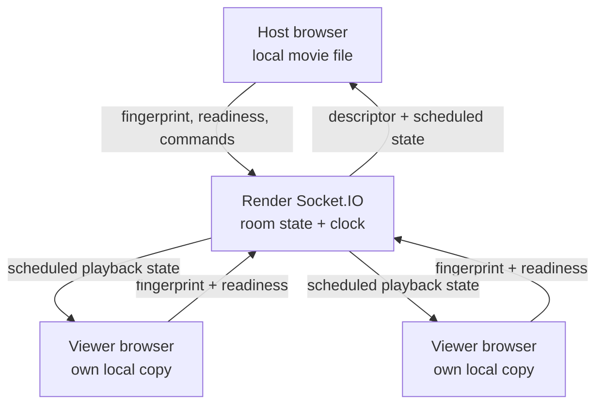
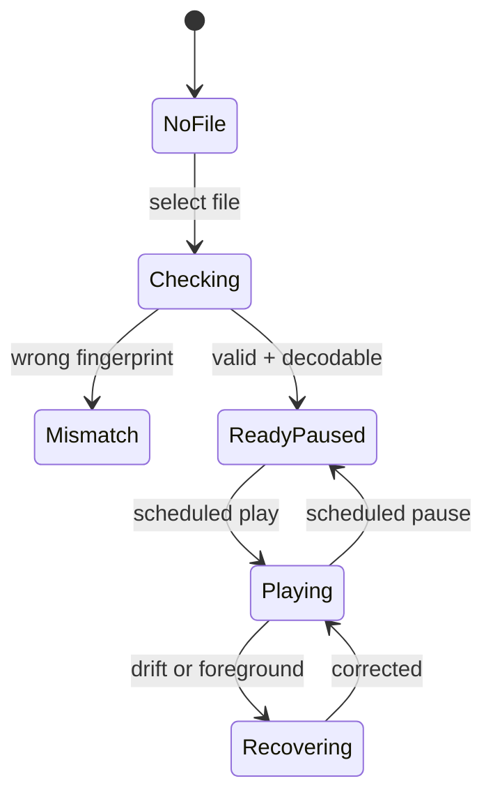

# Watchly Local-File Sync Blueprint

**Prepared:** 26 August 2026  
**Reviewed:** deployed Watchly site and the supplied `watchly-master (2).zip`  
**Target stack:** React/Vite on Vercel + Express/Socket.IO on Render

## 1. Final recommendation

Build **Local File Sync** as Watchly's primary new source mode:

- Every participant selects their own copy of the movie from their device.
- The movie is played from a browser-local `blob:` URL.
- Watchly sends only the file fingerprint, readiness state, and playback commands.
- The video bytes are never uploaded to Vercel, Render, Socket.IO, or another user.
- The server remains the authority for play, pause, seek, control ownership, and time.

This is the same basic product model used by [Syncplay](https://syncplay.pl/about/syncplay/): synchronize players while every user keeps a local copy. Watch2Gether also distinguishes synchronized playback from a screencast; its synchronized modes control the video each user can access instead of sending one user's picture to everyone else ([Watch2Gether explanation](https://community.w2g.tv/t/will-not-display-video/53379)).

Add **true screen sharing** only afterward as a clearly marked beta for small rooms. It can use WebRTC, but it cannot be promised as unlimited, reliable, and free on every network because some connections require TURN relay bandwidth.

### The product wording should be

| Button | Meaning |
|---|---|
| **Watch Local File** | Everyone selects the same file; best quality; no upload; recommended |
| **Watch from Link** | Existing YouTube, Vimeo, direct URL, Google Drive, and Archive modes |
| **Share Screen (Beta)** | Host streams a tab/window over WebRTC; small rooms only |

Do not call the first mode an upload. The UI should say **Select file from this device** and **The file never leaves your device**.

---

## 2. What the current project already has

The supplied project is a good base. It already has:

- React 19 + Vite frontend on Vercel.
- Express + Socket.IO backend intended for Render.
- In-memory rooms, user roles, chat, a queue, reconnect handling, and network ping.
- Host/moderator play, pause, seek, and a progress update every two seconds.
- Viewer drift correction.
- WebRTC mesh voice chat with Socket.IO signaling.
- Existing URL playback through ReactPlayer plus a native `<video>` path for Google Drive proxying.

The local video feature does **not** exist yet. The only current file picker is for subtitle files.

### Problems that must be fixed before adding local files

| Current behavior | Why it can fail | Required correction |
|---|---|---|
| Opening `/room/RZWL59M` without an existing `sessionStorage` session redirects to `/` | A shared room link cannot directly onboard a new user | Show a nickname/join dialog on the room URL; never redirect merely because local session data is absent |
| `join_room` creates a room when the code does not exist | Mistyped or expired links silently create a new room and make the visitor Host | Split `room:create` and `room:join`; return `ROOM_NOT_FOUND` for an invalid join |
| Render reconnection gives up after six seconds | A free Render service can take about a minute to wake after 15 minutes idle | Show `Starting room server…` and retry for up to 90 seconds with backoff ([Render free-service limits](https://render.com/docs/free)) |
| Rooms are kept in a plain JavaScript object keyed by user input | Special keys such as `__proto__` are unsafe | Replace `const rooms = {}` with `new Map()` |
| Room state exists only in Render memory | A Render restart/deploy loses every room | Treat rooms as intentionally temporary; show `Room expired` and offer the Host a new room. Persistence can be a later feature |
| A disconnected Host is immediately replaced but keeps the Host role when reconnecting | Two Hosts can then issue conflicting commands | Use one explicit controller lease with a reconnect grace period and atomic transfer |
| Client-chosen `userId` is accepted as identity | Roles can be recovered or impersonated incorrectly | Server issues a random resume token and validates it on reconnect |
| Playback events exclude the sender and the sender updates optimistically | Local and server state can diverge or race | Server broadcasts the accepted authoritative state to **all** clients, including the sender |
| Client timestamps use `Date.now()` | Different device clocks cause start-time skew | Estimate server-clock offset with ping samples and schedule commands against server time |
| Normal drift is corrected only after two seconds | Two seconds is visibly out of sync | Use small playback-rate corrections from 150–750 ms and hard correction above 750 ms |
| WebRTC signaling forwards to any supplied socket ID | A sender is not checked against the target room | Require both peers to be connected members of the same room; rate-limit and size-limit SDP/ICE payloads |
| Voice uses shared fallback TURN credentials in frontend code | Public/static credentials can be abused or exhausted | Use account-specific short-lived ICE credentials; do not hard-code a reusable secret |
| Chat accepts nickname and role inside the client message | A client can impersonate another displayed user | Construct nickname and role on the server from the authenticated room member |
| PWA can serve an older frontend during a backend deployment | Old and new event schemas can conflict | Add `protocolVersion`; show a refresh-required screen on mismatch |

The supplied room URL redirected during review for the first reason above: the room route depends on a session that exists only in the browser that originally joined.

---

## 3. Recommended architecture



There is deliberately no media-data path through the server. Browsers can create a local object URL for a user-selected `File`, and the URL must be revoked when it is replaced or the room is left ([MDN File API guide](https://developer.mozilla.org/en-US/docs/Web/API/File_API/Using_files_from_web_applications)).

### Hosting responsibilities

| Component | Responsibility | Must never do |
|---|---|---|
| Vercel frontend | UI, local file picker, fingerprint worker, native player, sync controller | Store or proxy a movie |
| Render backend | Room membership, controller lease, clock replies, authoritative playback state, tiny Socket.IO events | Receive file chunks or video frames |
| User browser | Read the selected file, decode it, play it, calculate local drift | Send the local `blob:` URL to another client |
| Optional TURN service | Relay encrypted WebRTC packets only when direct screen-share/voice P2P fails | Participate in Local File Sync |

Keep Socket.IO on Render for this project. Render supports long-lived WebSockets, although connections can be interrupted during deploys or instance replacement and must reconnect ([Render WebSocket documentation](https://render.com/docs/websocket)). Vercel supports WebSockets with Fluid compute in its current platform, but moving the working realtime backend adds no benefit to Local File Sync ([Vercel WebSockets](https://vercel.com/docs/functions/websockets)).

---

## 4. Exact Local File Sync user flow

### A. Host creates the room

1. Host enters a nickname and clicks **Create Room**.
2. Backend creates a room and returns:
   - `roomId`
   - stable `memberId`
   - secret `resumeToken`
   - `protocolVersion`
3. Frontend stores the resume information in `sessionStorage`.
4. Room URL is immediately shareable. A new visitor opening it sees the nickname/join dialog on that URL.

### B. Host chooses the local movie

1. Host selects **Watch Local File**.
2. A normal `<input type="file">` opens. Use this baseline path instead of depending on `showOpenFilePicker`, which is not universal.
3. Frontend holds the returned `File` only in memory.
4. A Web Worker calculates `sampled-sha256-v1` without reading the whole movie into memory.
5. Frontend creates a temporary object URL with `URL.createObjectURL(file)` and loads it into a native `<video>` element.
6. It waits for `loadedmetadata` and records duration, dimensions, and whether the browser can decode the source.
7. Host sends only a safe media descriptor to the server.
8. Server switches the room to `WAITING_FOR_FILES`, paused at `0`, and broadcasts the descriptor.

### C. Every viewer selects their copy

1. Viewer sees the title chosen by the Host, size, duration, and **Select your copy**.
2. Viewer selects a file from their own device.
3. Viewer computes the same fingerprint and loads metadata locally.
4. Viewer sends one readiness result:
   - `READY`: fingerprint matches and video loaded.
   - `MISMATCH`: fingerprint does not match.
   - `UNSUPPORTED`: browser cannot decode it.
   - `ERROR`: file could not be read.
5. Server broadcasts the room readiness list using stable member IDs.
6. Host sees `3/4 ready`, with an exact reason beside every unready user.
7. **Start for ready users** becomes available. Default behavior should wait for everyone, but the Host may explicitly start without an unready member.

### D. Synchronized start

1. Host clicks Play.
2. Client sends `playback:command` with an idempotent `commandId`.
3. Server validates the current controller and media ID.
4. Server increments `seq` and chooses `effectiveAtServerMs = now + 750`.
5. Server broadcasts the accepted state to everyone, including the Host.
6. Each browser converts the server deadline into its local monotonic clock.
7. At that deadline it sets the correct target time and calls `video.play()`.
8. If the event arrived after the deadline, the client immediately starts at the time the room should now be showing.

### E. Pause and seek

- **Pause:** server calculates the authoritative position, schedules the pause, and broadcasts it with the next `seq`.
- **Seek while paused:** every ready player moves to the exact requested time and remains paused.
- **Seek while playing:** server schedules the new position; late clients add elapsed time after the scheduled deadline.
- **Out-of-order event:** a client ignores any state whose `seq` is not greater than its last applied sequence.
- **Duplicate event:** `commandId` makes a retried command idempotent.

### F. Late join, refresh, and reconnect

- A late joiner receives the descriptor and current authoritative playback state, selects the file, and catches up only after becoming ready.
- A page refresh loses the `File` reference by browser design. The user must select the file again; the resume token restores the identity and role.
- Socket reconnection preserves the local `File` as long as the page itself did not reload. After reconnect, the client fetches a fresh state snapshot before applying any queued command.
- When the tab becomes visible after being backgrounded, run an immediate clock sample and hard resync if necessary.

### G. End of media

Only the current controller sends `ENDED`. The server confirms that the position is near the declared duration, then broadcasts a paused state at the duration. A local-file queue should be a later feature because every participant must preselect every queued file.

---

## 5. File identity and privacy

### Descriptor sent to the room

```json
{
  "sourceType": "local-file",
  "mediaId": "sampled-sha256-v1:734003200:9d2c...",
  "fingerprintVersion": "sampled-sha256-v1",
  "displayTitle": "Movie night",
  "sizeBytes": 734003200,
  "durationMs": 5412740
}
```

Do not send the local path. Do not require the same filename. A renamed identical file should match.

### Fingerprint algorithm

Use a Web Worker and this deterministic algorithm:

1. If the file is 2 MiB or smaller, hash the full file.
2. Otherwise take 32 evenly spaced 64 KiB slices, including the beginning and end.
3. Prefix the bytes with the fingerprint version and exact file size.
4. SHA-256 the combined approximately 2 MiB buffer.
5. After the object URL loads, also require duration to be within 250 ms of the Host's duration.

`Blob.slice()` and `Blob.arrayBuffer()` are available in Web Workers ([MDN `Blob.slice`](https://developer.mozilla.org/en-US/docs/Web/API/Blob/slice), [MDN `arrayBuffer`](https://developer.mozilla.org/en-US/docs/Web/API/Blob/arrayBuffer)). Web Crypto SHA-256 is suitable for the resulting small buffer, but its standard `digest()` method is not streaming, so it should not receive a multi-gigabyte full file ([MDN `SubtleCrypto.digest`](https://developer.mozilla.org/en-US/docs/Web/API/SubtleCrypto/digest)).

This sampled fingerprint is an identity check for ordinary watch parties, not an adversarial security proof. A future “strict verification” option can use an incremental WASM SHA-256 implementation to hash every byte, but it should not block the first release because hashing a multi-gigabyte movie can take a long time on phones.

### Privacy promises the UI may truthfully show

- “The movie never leaves your device.”
- “Watchly shares only a fingerprint, file size, duration, and playback state.”
- Do not log filenames or fingerprints on the server.
- Let the Host set `displayTitle`; do not expose the real local filename by default.

---

## 6. Authoritative room and playback data model

```js
room = {
  id,
  protocolVersion: 2,
  createdAt,
  lastActiveAt,
  members: Map<memberId, {
    socketId,
    nickname,
    role,
    connected,
    resumeTokenHash,
    mediaStatus,
    lastSeenAt
  }>,
  controllerMemberId,
  controllerLeaseUntil,
  media: null | {
    sourceType,
    mediaId,
    fingerprintVersion,
    displayTitle,
    sizeBytes,
    durationMs
  },
  playback: {
    seq,
    status,              // "paused" | "playing"
    positionSec,
    rate,
    effectiveAtServerMs,
    updatedByMemberId
  },
  recentCommandIds,
  queue,
  chatHistory
}
```

Canonical current position is:

```text
paused:  positionSec
playing: positionSec + (serverNowMs - effectiveAtServerMs) / 1000
```

Clamp it to `[0, media.duration]`.

### Control ownership

- Keep roles (`Host`, `Moderator`, `Viewer`) separate from the single active `controllerMemberId`.
- Only the controller may issue playback commands.
- When the controller disconnects, hold the lease for 15 seconds.
- If the same resume token reconnects, restore control.
- Otherwise elect one connected Moderator, then the longest-connected Viewer.
- Broadcast one atomic `control:changed` event.
- A reconnecting former Host does not automatically become a second controller.

---

## 7. Socket.IO protocol contract

Use acknowledgements for requests and one structured error shape: `{ code, message, retryable }`.

| Event | Direction | Important payload/result |
|---|---|---|
| `room:create` | Client → server | nickname, protocolVersion → room snapshot, memberId, resumeToken |
| `room:join` | Client → server | roomId, nickname, optional resume token → snapshot or `ROOM_NOT_FOUND` |
| `room:snapshot` | Server → client | Full current member, media, readiness, controller, and playback state |
| `clock:ping` | Client ↔ server | Client timestamps + `serverTimeMs` |
| `media:declare` | Controller → server | Local-file descriptor; server validates bounds and changes epoch |
| `media:declared` | Server → room | Accepted descriptor and paused playback state |
| `media:ready` | Client → server | mediaId, `READY/MISMATCH/UNSUPPORTED/ERROR` |
| `media:readiness` | Server → room | Status keyed by stable memberId |
| `playback:command` | Controller → server | commandId, mediaId, action, observed position or seek target |
| `playback:state` | Server → room | seq, status, position, rate, effective server time |
| `playback:telemetry` | Client → server | local position, readyState, buffering, last seq; rate-limited |
| `control:changed` | Server → room | controllerMemberId and reason |
| `room:error` | Server → client | Typed error; never only a toast string |

Every handler must derive room and sender identity from `socket.data`, not trust a `roomId`, nickname, role, or sender ID supplied inside the event body.

### Validation limits

- Room code: exact seven uppercase base-36 characters.
- Nickname: normalized text, 1–24 characters.
- Display title: normalized text, 1–100 characters.
- Size: positive safe integer with a reasonable upper bound.
- Duration and positions: finite, non-negative, and clamped.
- Fingerprint: exact algorithm prefix and hex length.
- Playback commands: maximum ten per second per controller, with burst control.
- SDP/ICE signaling: sender and target must be in the same room; cap serialized payload sizes.

---

## 8. Clock synchronization and drift correction

### Clock offset

On join, take seven ping samples. For each sample:

```text
roundTrip = clientReceive - clientSend
offset = serverTime - ((clientSend + clientReceive) / 2)
```

Use the median offset from the five lowest-round-trip samples. Refresh periodically and after reconnect or `visibilitychange`. Use `performance.timeOrigin + performance.now()` for client-side monotonic timing rather than scheduling directly from a changing wall clock.

### Applying room state

| Absolute drift | Client action |
|---:|---|
| ≤ 150 ms | Keep `playbackRate = 1.0` |
| 150–750 ms | Temporarily use approximately `0.97–1.03`, then return to `1.0` |
| > 750 ms | Hard seek to canonical time |
| Explicit seek/new media/reconnect | Hard seek regardless of drift |

Never chase the Host while the local element is buffering, seeking, or lacks metadata. When it returns to `playing`, calculate the current canonical target and catch up once. This prevents the buffering/seek loop already noted in the existing player comments.

### Realistic target

Do not advertise frame-perfect sync. Different browsers seek to different media keyframes and schedule media differently. Use these release targets on a stable connection:

- Play/pause skew: ≤ 250 ms for 95% of desktop trials.
- Steady playback drift: ≤ 250 ms desktop and ≤ 500 ms cross-browser/mobile.
- Recovery after reconnect or foregrounding: within two seconds.

Watch2Gether itself describes its goal as social viewing rather than exact-frame synchronization ([discussion](https://community.w2g.tv/t/tighten-up-the-sync/58010)).

---

## 9. Player implementation

For Local File Sync, use a dedicated native `<video>` adapter instead of forcing more conditions into the current 900-line `VideoPlayer.jsx`.



Recommended split:

- `VideoPlayer.jsx`: source-mode shell and common layout.
- `RemoteVideoAdapter.jsx`: existing ReactPlayer/link behavior.
- `LocalFileAdapter.jsx`: `File`, object URL, native video events, local volume/subtitles.
- `LocalFilePicker.jsx`: selection, verification, and readiness UI.
- `ReadinessPanel.jsx`: per-member statuses and Host start decision.
- `useSynchronizedMedia.js`: sequence handling, scheduled actions, drift correction.
- `useServerClock.js`: ping sampling and server-time conversion.
- `mediaFingerprint.worker.js`: sampled fingerprint computation.
- `mediaFingerprint.js`: worker wrapper and descriptor validation.

Important player rules:

- Do not set `crossOrigin="anonymous"` on a local `blob:` source.
- Revoke the previous object URL on source replacement, leave, and unmount.
- Lock Viewer timeline controls but keep local volume, captions, fullscreen, and a **Resync** button.
- Listen to `loadedmetadata`, `canplay`, `playing`, `waiting`, `stalled`, `seeking`, `seeked`, `ended`, and `error`.
- Detect unsupported formats from both `canPlayType()` hints and the actual media error. Browser media support varies by browser and OS ([MDN media-format guide](https://developer.mozilla.org/en-US/docs/Web/Media/Guides/Formats)).
- Recommend MP4 with H.264 video and AAC audio for the widest practical compatibility. WebM is a second supported target. Treat MKV and unusual codecs as best effort, not promised support.
- A user action is still needed when audible autoplay is blocked. The Ready button should attempt to prime playback, and a **Click to enable playback** overlay must remain as fallback ([MDN autoplay guide](https://developer.mozilla.org/en-US/docs/Web/Media/Guides/Autoplay)).

---

## 10. Failure-handling matrix

| Failure | Detection | User-visible behavior | Recovery |
|---|---|---|---|
| Wrong file | Fingerprint mismatch | Red `Different file` status; cannot become ready | Select another file |
| Same movie but different encode | Fingerprint mismatch, possibly duration mismatch | Explain that every user needs the same file copy | Use identical copy; no unsafe override in v1 |
| Renamed identical file | Fingerprint matches | Accepted | None needed |
| Unsupported codec | Media `error`/failed metadata | Show codec guidance, not generic `Could not load` | Use MP4 H.264/AAC or a supported browser |
| File moved/deleted after selection | Read/play error | Mark local status `ERROR`; pause only that player | Reselect the file, then catch up |
| Page refresh | No in-memory `File` | Identity returns, status becomes `SELECT_FILE` | Reselect; catch up automatically |
| Browser blocks autoplay | `video.play()` rejects `NotAllowedError` | Full player overlay | User clicks once; immediately seek to room time |
| Viewer joins late | No local file | Other users continue by default | Viewer selects file and catches up |
| Viewer buffers/slow disk | `waiting`/`stalled` | Mark Viewer as buffering | Do not repeatedly seek; one correction after recovery |
| Tab background throttling | `visibilitychange` and drift | No repeated toasts | Fresh clock sample and resync on return |
| Socket drops | Socket.IO disconnect | `Reconnecting` status; local player pauses by default | Rejoin with resume token, receive snapshot, resync |
| Render cold start | Connection attempts but API is not ready | `Starting room server… this can take about a minute` | Retry with capped backoff for 90 seconds |
| Render restart/deploy | Server returns `ROOM_NOT_FOUND` | `This temporary room expired` | Host creates a new room; everyone reuses local file |
| Host briefly disconnects | Controller lease active | Room pauses; `Waiting for Host (15s)` | Restore Host if token returns; otherwise elect once |
| Two moderators act | Only controller accepted | Non-controller command rejected without changing local state | Request/take control through explicit UI |
| Duplicate/out-of-order event | `commandId` and `seq` | No visible flicker | Ignore duplicate/stale command |
| Stale PWA client | Protocol mismatch | Blocking update banner | Activate service worker update and reload |
| Local object URL leak | Source lifecycle tracking | No user-facing symptom | Always `URL.revokeObjectURL()` |

---

## 11. True screen sharing: optional beta only

This is a different system from Local File Sync.

### How it would work

1. Host clicks **Share Screen (Beta)**.
2. In that click handler, call `navigator.mediaDevices.getDisplayMedia()` so the browser can show its own tab/window/screen chooser.
3. Ask for up to 1280×720 at 30 fps and optional audio.
4. Set the captured video track's `contentHint` to `motion` for a movie.
5. Create one WebRTC peer connection per Viewer.
6. Use the Render Socket.IO server for authenticated SDP/ICE signaling only.
7. Media flows peer-to-peer; it never passes through Socket.IO.
8. Cap the beta at one sharer plus three Viewers.
9. Apply an approximate 2.5 Mbps maximum video bitrate per sender with `RTCRtpSender.setParameters()`.
10. When the captured track's `ended` event fires, close every share peer and broadcast `screen:stopped`.

`getDisplayMedia()` must be triggered by user activation, always lets the user choose what to share, and audio availability varies by browser/source ([MDN `getDisplayMedia`](https://developer.mozilla.org/en-US/docs/Web/API/MediaDevices/getDisplayMedia)). WebRTC normally needs TURN when a direct peer connection cannot be made; commercial services commonly use it for that reason ([WebRTC peer-connection guide](https://webrtc.org/getting-started/peer-connections)).

### Why it cannot have the same “always free” promise

In a mesh, the Host sends a separate copy to every Viewer. At 2.5 Mbps:

- one Viewer uses about 1.125 GB of Host upload per hour;
- four Viewers use about 4.5 GB per hour and about 10 Mbps of Host uplink;
- if TURN is required, relay quota is also consumed.

Metered currently advertises 20 GB/month for its Open Relay free TURN offering, so a few relayed movie sessions can use the free allowance ([Open Relay](https://www.metered.ca/tools/openrelay/)). Therefore:

- Local File Sync can honestly be marketed as free and high quality.
- Screen Share Beta can be free within quotas and when P2P works, but not unlimited or guaranteed on every NAT/firewall.
- Do not run an SFU, transcoder, or video relay on Render's free service.
- Do not reuse the current voice `RTCPeerConnection` objects for the first screen-share version. A separate `ScreenShareManager` avoids breaking voice during renegotiation.
- Do not ship static TURN credentials. Fetch short-lived ICE credentials from the backend.

### Screen-share failure states

- Unsupported browser: hide/disable with explanation.
- Permission denied: remain in normal room; never auto-retry the permission prompt.
- Host did not include tab audio: show `No shared audio — stop and choose Share tab audio`.
- ICE failure: one ICE restart, then show `Direct connection failed`.
- Viewer autoplay blocked: click-to-unmute/play overlay.
- Host network insufficient: reduce bitrate/resolution; never move frames to Socket.IO.
- Participant limit reached: suggest Local File Sync.

---

## 12. Implementation order and acceptance gates

### Phase 0 — Make rooms dependable

Change:

- Deep-link nickname/join UI.
- Separate create and join.
- `Map`-based room store.
- Stable member ID + server resume token.
- Single controller lease.
- Typed acknowledgements and errors.
- 90-second Render warm-up/reconnect UI.
- Protocol-version handshake.
- Same-room validation for current WebRTC voice signaling.

Gate:

- Two clean browsers can open one shared URL and join.
- Wrong code shows `Room not found` and never creates a room.
- Host reconnects without producing two Hosts.
- Cold start does not produce a false six-second failure.

### Phase 1 — Local file selection and readiness

Change:

- Source-mode selector.
- Fingerprint worker.
- Local object URL lifecycle.
- Media descriptor and readiness protocol.
- Per-member readiness panel.
- Native Local File adapter.

Gate:

- Identical renamed copies match.
- Different files are blocked.
- A 4+ GB file does not get loaded into JavaScript memory.
- Network tools show zero movie-byte upload.
- Refresh correctly asks only that user to reselect.

### Phase 2 — Server-time synchronization

Change:

- Server clock estimator.
- Authoritative playback reducer with `seq`, `commandId`, and scheduled time.
- Rate-based soft correction and hard-resync thresholds.
- Visibility, buffering, late-join, and reconnect recovery.
- Server broadcasts accepted state to sender and viewers.

Gate:

- Pass the skew targets in Section 8.
- Artificial delay and event reordering do not cause backward jumps or play/pause loops.
- A late participant becomes synchronized after selecting the file.

### Phase 3 — Screen Share Beta

Change only after Phases 0–2 are stable:

- Dedicated screen-share hook/manager.
- Secure same-room signaling.
- Account-specific TURN credentials.
- Participant and bitrate caps.
- Permission, audio, ICE, and stop-state UI.

Gate:

- Chrome/Edge desktop, one Host + three Viewers.
- Voice remains active when screen share starts/stops.
- No media frames appear in Render traffic or logs.
- Direct and TURN-relayed test cases have clear status.

---

## 13. File-by-file implementation map

### Existing frontend files

| File | Planned change |
|---|---|
| `frontend/src/context/RoomContext.jsx` | Replace optimistic event fragments with room snapshots, readiness map, controller, protocol version, typed errors, and accepted playback state |
| `frontend/src/components/VideoPlayer.jsx` | Convert into a source-mode shell; move remote and local playback into adapters |
| `frontend/src/components/RoomLayout.jsx` | Add readiness/status surface and cold-start/reconnect state; keep the room URL visible |
| `frontend/src/components/LandingPage.jsx` | Use explicit create API; do not treat join as create |
| `frontend/src/socket.js` | Expose connection phases and protocol mismatch; retain bounded reconnect |
| `frontend/src/components/VoiceRoom.jsx` | Move ICE config out of shipped static credentials; validate lifecycle and use secure signaling events |

### New frontend files

```text
src/components/player/RemoteVideoAdapter.jsx
src/components/player/LocalFileAdapter.jsx
src/components/player/LocalFilePicker.jsx
src/components/player/ReadinessPanel.jsx
src/hooks/useServerClock.js
src/hooks/useSynchronizedMedia.js
src/workers/mediaFingerprint.worker.js
src/utils/mediaFingerprint.js
src/utils/playbackMath.js
src/utils/protocol.js
```

Optional Phase 3:

```text
src/components/player/ScreenShareAdapter.jsx
src/hooks/useScreenShare.js
```

### Backend

The current `backend/server.js` is already large. Split it while adding the new protocol:

```text
backend/server.js
backend/roomStore.js
backend/validators.js
backend/events/roomEvents.js
backend/events/playbackEvents.js
backend/events/mediaEvents.js
backend/events/webrtcEvents.js
backend/playback/canonicalState.js
```

Keep the existing Google Drive proxy isolated from room-state code. Local File Sync must never call that proxy.

---

## 14. Verification plan

### Unit tests

- Fingerprint is deterministic across chunk boundaries.
- Renaming does not change media ID.
- Changing sampled bytes or size changes media ID.
- Canonical-time formula for paused, playing, early, and late commands.
- `seq` rejects stale states.
- `commandId` deduplicates retries.
- All numeric and string validators reject malformed/oversized input.
- Controller election cannot yield two controllers.

### Socket integration tests

- Create, join, expired join, resume, duplicate resume, and Host handover.
- Viewer cannot issue playback commands.
- Moderator cannot control unless holding the controller lease.
- Media readiness is isolated per room.
- WebRTC sender cannot signal a socket in another room.
- Render-like server restart produces a typed expiration flow.

### Browser end-to-end tests

Use Playwright with a short MP4 fixture and two or three browser contexts:

1. Same file, play/pause/seek.
2. Wrong file blocked.
3. Late join.
4. Refresh/reselect/catch-up.
5. Autoplay rejection and click recovery.
6. Background tab then return.
7. Artificial 100/300/800 ms Socket.IO delay and event reorder.
8. Host disconnect inside and outside the 15-second grace period.
9. Source replacement revokes the old object URL.
10. Mobile viewport and touch controls.

Manual browser matrix:

- Chrome desktop: primary target.
- Edge desktop: primary target.
- Firefox desktop: supported target.
- Safari macOS/iOS: best effort with MP4 H.264/AAC; document autoplay and background limitations.
- Android Chrome: supported for compatible files, with memory/thermal testing of the fingerprint worker.

### Load and cost tests

- 50 sockets in a room with clock pings and playback heartbeat.
- Verify payload rate and Render outbound bandwidth.
- Confirm that selecting and watching a local file creates no media HTTP request.
- Confirm that the existing Google Drive mode, not Local File Sync, is the only mode capable of consuming proxy video bandwidth.

---

## 15. Hosting and cost conclusion

The recommended mode fits the existing free deployment because:

- Vercel serves only static application assets.
- Render carries only small JSON messages and WebSocket heartbeats.
- The movie uses the participant's local disk and decoder.
- No object storage, CDN, transcoding, or video egress is required.

Render's free service currently offers 750 instance hours per workspace per month, spins down after 15 minutes without inbound HTTP requests or WebSocket messages, and can restart at any time ([Render free documentation](https://render.com/docs/free)). During an active Watchly room, the existing network pings count as WebSocket activity, so idle spin-down is mainly a first-join problem. A platform restart remains possible; the UI must treat rooms as temporary unless persistent storage is added later.

### Non-negotiable “do not build this” list

- Do not upload every participant's movie to Vercel or Render.
- Do not send chunks, base64 video, or frames through Socket.IO.
- Do not broadcast a `blob:` URL; it only works in the browser that created it.
- Do not compare only filename and duration.
- Do not hash an entire multi-gigabyte file with one `crypto.subtle.digest()` buffer.
- Do not allow multiple moderators to be simultaneous playback authorities.
- Do not trust client clocks, roles, nicknames, room IDs, or sender IDs.
- Do not silently make an expired room when a join code is missing.
- Do not promise MKV support or exact-frame sync across all browsers.
- Do not promise unlimited free screen sharing through TURN.

## 16. Definition of done

The feature is ready when four people can open one shared room link, select identical local copies, see verified readiness, and watch through play/pause/seek/reconnect without any movie bytes leaving their devices; incorrect files and unsupported codecs fail clearly; the room has exactly one playback controller; and every recovery state described above has been deliberately tested.

